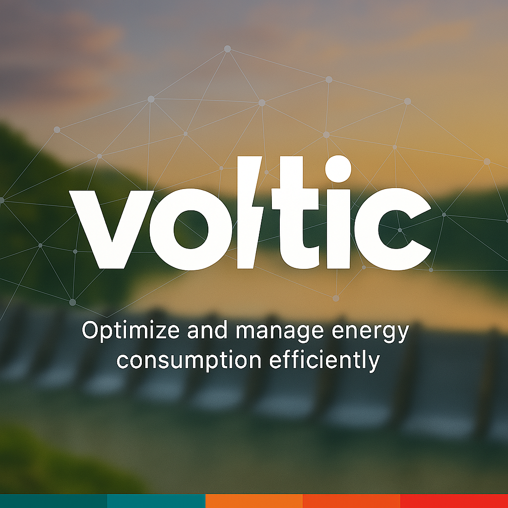
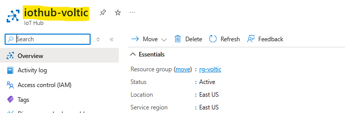
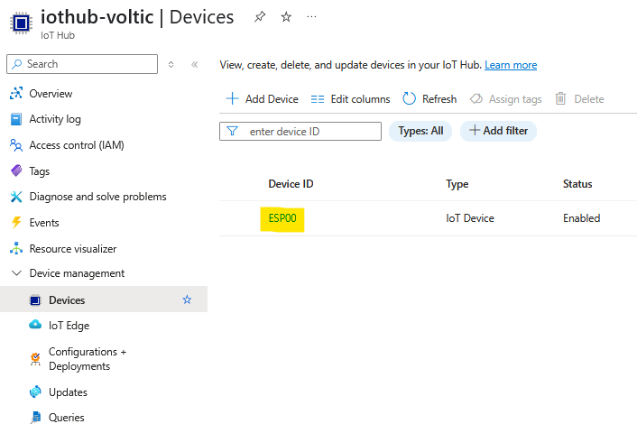

# VOLTIC: Inteligência Energética para Cidades do Futuro

<div align="center">
  
</div>

<div align="center">
  
</div>

---

## Descrição do Projeto

**VOLTIC** é um projeto experimental desenvolvido para monitorar e otimizar o consumo de energia elétrica em tempo real. Integrando hardware, firmware, backend e frontend, o projeto oferece uma solução completa para cidades inteligentes, residências, prefeituras e empresas, promovendo a sustentabilidade e a eficiência energética.

Utilizando tecnologias emergentes de IoT, inteligência artificial e análise de dados, o VOLTIC permite a identificação de padrões de consumo e a implementação de medidas para reduzir desperdícios, contribuindo para a gestão eficiente dos recursos energéticos.

---

## Conteúdo do Repositório

- **/Diagrams**: Diagramas completos do projeto, incluindo diagramas elétricos e de arquitetura.  
- **/Frontend**: Código-fonte do frontend, responsável pela interface de visualização e interação com os dados.  
- **/Backend**: Código-fonte do backend, que processa, armazena e gerencia os dados coletados pelos sensores.  
- **/Hardware**: Esquemas elétricos, diagramas e código do firmware para o dispositivo IoT.

---

## Tecnologias Utilizadas

### Hardware / Firmware
- Microcontrolador: **ESP32 DevKit WROOM-32D**
- Sensores: **ACS712 30A (corrente)** e **ZMPT101B (tensão)**
- Fonte: **Hi-Link HLK-PM03 3.3V**

### Backend
- **Spring Boot**
- **Azure CosmosDB**  
- **Azure IoT Hub**

### Frontend
- **Next.js**
- **Shadcn**
- **Kubb.js**

### Documentação & Diagramas
- **KiCad** para diagramas elétricos  
- Documentação em **PDF** e **Markdown**

---

## Objetivos do Projeto

- **Monitoramento Contínuo**: Medir o consumo de energia em tempo real utilizando sensores inteligentes.  
- **Otimização do Consumo**: Identificar padrões e desperdícios para auxiliar na redução do consumo energético.  
- **Integração Completa**: Unir hardware, firmware, backend e frontend em um sistema integrado.  
- **Sustentabilidade**: Promover o uso consciente da energia elétrica, contribuindo para cidades mais inteligentes e sustentáveis.

---

## Mídia do Projeto

> Vídeo demonstrando o projeto em ação:

[](https://www.youtube.com/watch?v=h4qSAQyx33U)

---

## Como Executar o Projeto

### Pré-requisitos

- **Backend**:
  - Java 21.0.2
  - Apache Maven 3.9.9
  - CosmosDB
  - IoT Hub com Device Cadastrado

- **Frontend**:
  - Node.js v20.19.0
  - NPM 10.8.2

- **Hardware/Firmware**:
  - Configuração do ESP32 com os sensores conectados

### Rodando o Backend

1. Clone o repositório.  
2. Navegue até o diretório `/Backend`.  
3. Configure as variáveis de ambiente conforme o arquivo `.env.example`.  
4. Execute:
   ```sh
   ./mvnw spring-boot:run
   ```
   ou o comando equivalente para Gradle.

> Importante dizer que, para rodar corretamente o backend, você deve criar as variáveis de ambiente com as chaves de conexão:

```sh
export SPRING_DATA_MONGODB_URI="mongodb:..."
export AZURE_IOTHUB_CONNECTION_STRING="Endpoint=sb://..."
```

5. Extra: Se desejar adicionar dados mockados, basta colocar o arquivo que está dentro da pasta `/Mock` em `/Backend/src/main/java/br/com/voltic` e executá-lo. É importante remover esse arquivo após a geração dos dados, pois ele deve ser executado apenas uma vez, para evitar duplicações ou conflitos com dados que serão gerados posteriormente.

6. **No arquivo `SecurityConfig.java`, no método `corsConfigurationSource()`**, configure corretamente os domínios autorizados a fazer requisições ao backend. Para isso, adicione os *Origins* permitidos na chamada de `setAllowedOrigins`, como no exemplo abaixo:

```java
configuration.setAllowedOrigins(Arrays.asList(
    "http://localhost:3000", // Ambiente de desenvolvimento local
    "https://seu-front-end.exemplo.com" // Frontend em produção (ex: Vercel)
));
```

### Rodando o Frontend

1. Navegue até o diretório `/Frontend`.  
2. Instale as dependências:
   ```sh
   npm install
   ```
3. Configure as variáveis de ambiente:

- Para Dev:

  ```sh
  export NEXT_PUBLIC_API_URL="http://localhost:8080"
  ```

- Para Prod:

  ```sh
  export NEXT_PUBLIC_API_URL="https://seu-back-end.exemplo.com"
  ```

4. Inicie o servidor de desenvolvimento:
   ```sh
   npm run dev
   ```

### Docker

Se for utilizar Docker para rodar o projeto, é importante adaptar os arquivos `Dockerfile` localizados em `/Frontend` e `/Backend` para incluir as variáveis de ambiente necessárias. Isso garante que:

- O backend consiga se conectar corretamente ao banco de dados hospedado na Azure;  
- O frontend possa se comunicar com o backend;  
- Os *Origins* estejam configurados de forma adequada, respeitando o ambiente (desenvolvimento ou produção).

Certifique-se de exportar variáveis como URLs da API, conexões com o banco e qualquer outro segredo necessário no ambiente de execução do contêiner.

---

### Firmware e Hardware

- Consulte a pasta `/Hardware` para acessar o código do firmware, e a pasta `Diagrams/Kicad` para diagramas e esquemas elétricos;  
- Utilize a **Arduino IDE** ou **PlatformIO** para programar o ESP32 com o código fornecido.

Para que o hardware consiga enviar os dados, é necessário gerar um `SAS_TOKEN`. Para isso, é preciso ter o **Azure CLI** instalado:

```sh
az iot hub generate-sas-token
            --hub-name iothub-voltic
            --device-id ESP00
            --duration 3600
```

No nosso caso, o nome do IoT Hub é `iothub-voltic`, o dispositivo é o `ESP00` e a duração do token foi definida como `3600` para testes rápidos.  
Esse comando irá gerar o `SAS_TOKEN` que deve ser inserido no arquivo `Hardware/firmware.ino`.

Nas duas figuras abaixo conseguimos notar onde encontramos, respectivamente, o nome do IoT Hub e o nome do dispositivo:

<details>
<summary>Imagens Exemplo Infra</summary>

Nome do IoT Hub:  


Nome do dispositivo:  


</details>

---

## Documentação Adicional

- [Diagrama Elétricos](./Diagrams/Kicad/Diagram.pdf)

---

## Resultados e Aplicações

O VOLTIC foi desenvolvido para:  
- Monitorar e otimizar o consumo energético em **residências**, **empresas** e **espaços públicos**;  
- Oferecer suporte para **prefeituras** e gestores em suas políticas de sustentabilidade;  
- Facilitar a implementação de **cidades inteligentes** e **smart grids**;  
- Reduzir custos operacionais e impactos ambientais através de um uso mais consciente da energia.

---

## Desenvolvedor

**Rickelme Gabriel Dias**  
[GitHub Profile](https://github.com/RickelmeDias)

---

<div align="center">
  <sub>Projeto VOLTIC: Inteligência Energética para Cidades do Futuro</sub>
</div>
